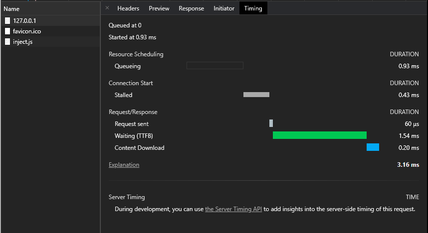

# Swoole test with PHP8.0 + JIT

Test setup

## Build php-swoole Docker image

    docker build -f ./Dockerfile -t swoole-php .

## Try your Swoole Application

On Linux or MacOS:

    docker run --rm -p 9501:9501 -v $(pwd):/app -w /app swoole-php server.php

Or on Windows:

    docker run --rm -p 9501:9501 -v C:/YOUR_DIR/:/app -w /app swoole-php server.php

You are able to access the hello world Swoole applicaiton from http://127.0.0.1:9501/

## Speed test with "Hello world" html server

## Read more

https://www.swoole.co.uk/